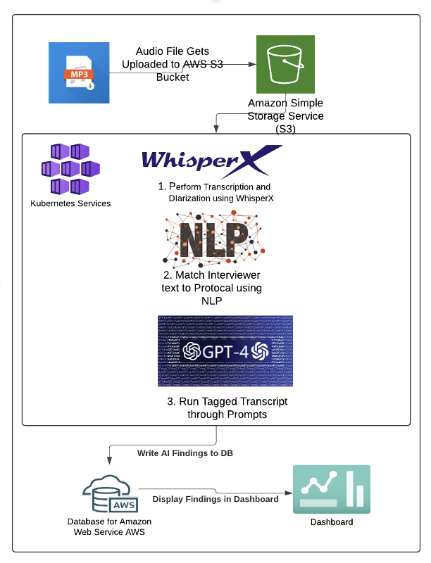

# Focus Group Audio File AI Pipeline (SDSS 2025)

This repository contains a reproducible version of the AI-driven pipeline described in our paper submitted to the *Journal of Data Science* (Data Science in Action section).

The full pipeline supports the analysis of focus group interviews, automating transcription, diarization, transcript tagging, and GPT-assisted insight generation. While our project relied on cloud services within Amazon Web Services (AWS) and Azure, we have provided mock data and sample output where cloud resources and infrastructure are required. Our codebase is primarily designed to run within this cloud environment, but users can refer to and execute the app_sample.py file to better understand the functionality and outputs of each step in the pipeline.

Please note that certain components— such as app_sample.py —are tightly coupled to private infrastructure, proprietary tools, and secure datasets that are not accessible outside of our internal environment. As such, this code may be non-functional without access to these systems and is difficult to reproduce or deploy externally. Additionally, sharing parts of the production code poses potential security risks, such as inadvertently exposing credentials, authentication logic, or system vulnerabilities. For these reasons, we have made the majority of the production code visible but encourage caution when attempting to run or modify it outside of its intended environment.


# Pipeline Overview



1) Audio is uploaded to AWS S3.

2) File gets pulled onto Azure Kubernetes service instance 

3) Kubernetes (AKS) services trigger WhisperX transcription and diarization using OpenAI API.

4) Interviewer speech is matched to protocol questions using semantic similarity scores.

5) GPT-4 generates structured findings using OpenAI API.

6) Outputs are stored in a database and surfaced via dashboards and excel files.

⚠️ This repository includes a reproducible, offline-capable version of the above pipeline, using mock data where needed to simulate cloud APIs.

# Cloud Services Configuration

Due to the large number of cloud services leveraged to make this a fully automated cloud pipeline, we recognize that replicating and running our original code is very reliant on that. While most will not be able to replicate this locally without access to these resources we do want to list all the resources we did use for any interested user.

- AWS
    * S3 Buckets
    * Relational Database
    * Custom built dashboard
- Azure
    * Kubernetes service
    * OpenAI API - Whisper and GPT-4o
    * Sharepoint Automation (send files to and from sharepoint automatically)

# Project Structure

aiPipeline-sdss2025/
├── ai_findings                  # Intermediary output folder for findings produced from OpenAI API
├── audio_files                    # Starting folder for audio files
├── audio_files_not_processed      # Intermediary output folder for audio files that were not able to be processed and need further investigation
├── audio_files_processed      # Intermediary output folder for audio files that were processed successfully
├── daily_logs                    # Where log files for each run will be written to
├── meta_data                     # Contains prompts used with OpenAI API and Mappings and Defnitions of Different Indicators
├── resources                     # Contains ini file to put in cloud infrastructure credentials if desired
├── sample_output_files           # Sample output files for users to use for mock data replication
├── scripts.                      # Contains all python scripts needed for code - more details in next section 
├── tagged_transcripts            # Intermediary output folder for transcripts tied to different discussed codes 
├── tagged_transcripts_crosswalks # Contains sample crosswalk used in step 4 to identify which interviewer questions go with particular codes 
├── word_diarized_transcripts     # Intermediary output folder for word transcripts with diarized speakers produced from audio file 
├── words_transcripts             # Intermediary output folder for word transcripts produced from audio file infrastructure to work
├── app_sample.py                 # Script allowing users to run code locally using mock data
└── requirements.txt              # Contains list of python packages needed to run scripts - recommend creating a virtual environment based off these packages

The folders ai_findings, audio_files, audio_files_not_processed, audio_files_processed, tagged_transcripts, word_diarized_transcripts, and word_transcripts are all output folders that are used to track and contain the output for each of the steps of the pipeline. Further description of each folder and how they correspond to the different sections is provided in the next section

# Output folders

1) sample_output_files - this folder contains all a sample file for each stage of the pipeline. Instructions for how to run and work with these files will be provided in the next section. Since much of our workflow relies on cloud infrastructure and connections these are meant to provide users an example of what their output would look like if they had access to these tools
2) ai_findings - final output folder for csv files containing findings produced from OpenAI API
3) audio_files - initial input folder where audio files get pulled into
3) audio_files_not_processed - tracking folder for when audio files are not able to be processed successfully
4) audio_files_processed - tracking folder for when audio files are able to be processed successfully
5) diarized_transcribed_text - output folder containing diarized word transcripts from audio file
6) tagged_transcripts - output folder that that shows how text was mapped to different indicators/codes
7) word_diarized_transcripts - output folder containing the diarized transcripts of the audio files 
8) word_transcripts - output folder containing the transcripts of the audio files 

# Sample Files
 For understanding purposes we have produced a sample output file for each stage of the pipeline including
 1) sample audio file - "sample_focus_group_interview.mp3"
 2) sample transcript - "sample_transcript.docx"
 3) sample diarized transcript - "sample_diarized_transcript.docx"
 4) sample tagged transcript - "sample_tagged_transcript.csv"
 5) sample AI Findings - "sample_ai_findings.csv"


# Reproducibility Instructions

**This version allows you to download the repo and work with the mock data and code to understand cloud infrastructure. The file 'app_sample.py' would need to be filled in by individual users based on how they would connect to their respective cloud infrastructure. We have provided a template to get users started but users would need to fill in cloud infrastructure details and connections to fully reproduce results. Users would need to fill 'resources/config_template.ini' and have the infrastructure setup to run this file.**

1) Clone the Repo

```
git clone https://github.com/your-username/autoreports-sdss2025.git
cd autoreports-sdss2025
```

2) Set Up the Environment
Use Python's built-in venv module to create a virtual environment and install dependencies with pip.

### Create and activate the virtual environment
**macOS / Linux:**
```
python3 -m venv venv
source venv/bin/activate
```
**Windows:**

```
python -m venv venv
venv\\Scripts\\activate
```

**Install dependencies**
```
pip install --upgrade pip
pip install -r requirements.txt
```

3) Move Sample Audio File from 'sample_output_files' folder into the 'audio_files' folder 

4) Run the pipeline
```
python3 app_sample.py
```

# In Depth Folder Description
### meta_data
The `meta_data/` folder contains various prompt_info and mapping for different elements and interviewer types
__indicator_map.csv__ csv format showing the different element names and numbers used by project team 

__indicator_name_map.json__ json format showing the different element names and numbers used by project team 

__indicator_number_map.json__ json format showing the different element names and numbers used by project team 

__prompt_info.json__ json format providing a description of each element and which ones can be expected in the different interviewer types 

## transcript_tagging_crosswalks

The `transcript_tagging_crosswalks/` folder contains crosswalk files mapping interviewer questions to different elements/codes that have been determined by project team

A sample 'principal_crosswalk' has been included for understanding purposes


### scripts
The `scripts/` folder contains various python scripts, each with its own purpose:

__audio_converstion.py__ handles converting audio files to transcripts

__config.py__ handles retrieving secrets and configuration parameters.

__lib.py__ handles creating external data clients (S3, database, Azure).

__logging_config.py__ handles setting up logging and logging configurations

__openai_usage.py__ token usage of OpenAI.

__parse_transcript.py__ contains functions that parse transcripts from audio files, create prompts for OpenAI API generation, and analyzing the transcripts

__s3_manager.py__ handles any interaction with S3.

__sharepoint_automation.py__ additional script used to send files to and from Sharepoint automatically 

__sort_transcript.py__ is for processing flagged transcripts into a friendlier format by sorting them by indicator.

__transcript_diarization.py__ contains functions used to diarize transcript and identify different speakers

__transcript_tagging.py__ contains functions used to match up text from transcripts with different elements/cpdes

__upload_findings_to_db.py__ contains functions used to upload final findings and text to cloud database


# Reproducibility Statement
This repository includes all necessary code, data samples, and environment configuration to reproduce the findings presented in our paper. Where proprietary services (e.g., Azure OpenAI, Azure Kubernetes, AWS S3) are required, we include mock outputs to simulate expected behavior. While users will need access to all these services to run locally , we have provided mock output to show what output looks like at each stage of the pipeline.

## 📬 Contact
For any questions or collaboration, contact **grahamchickering@gmail.com**, **gchickering@air.org**, or **cjones@air.org**. 