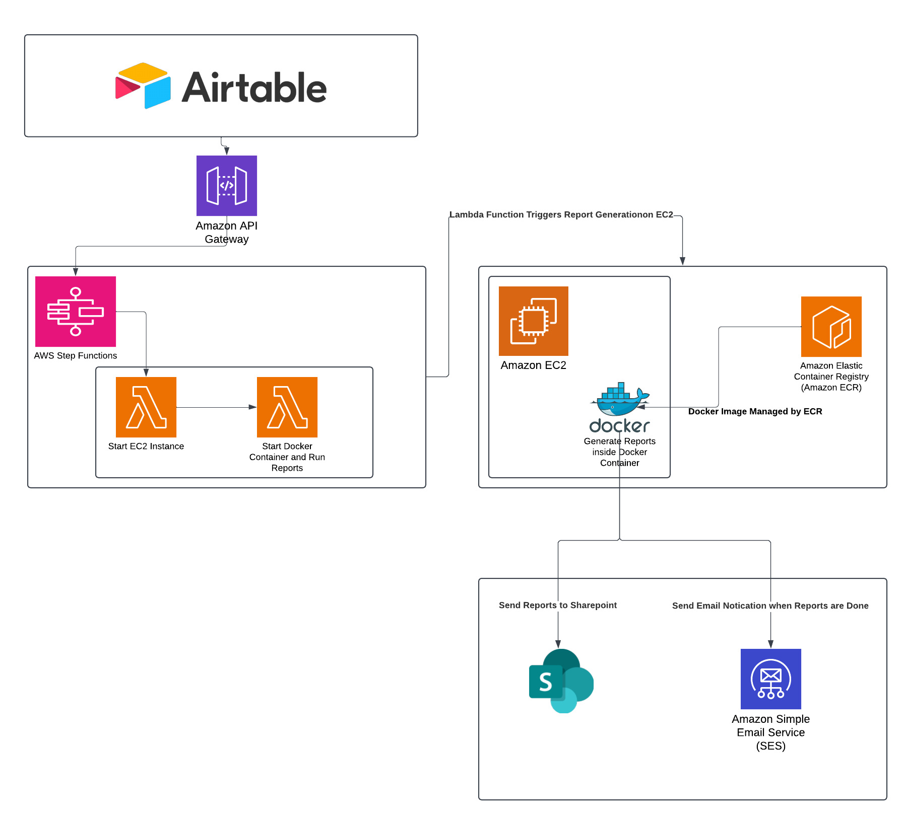

# Focus Group Audio File AI Pipeline (SDSS 2025)

This repository contains a reproducible version of the Automated Reports described in our paper submitted to the *Journal of Data Science* (Data Science in Action section). While the purpose of our paper is to focus on how this type of infrastructure can be used to automate the running of various scripts using cloud infrastructure, we have provided examples of mock data and infrastructure diagrams to demonstrate how this code could be run locally. 

While the acutal running of the pipeline leverages cloud infrastructure within AWS and Airtable that is not able to be reproduced locally, we still provide an infrastructure diagram and overview of how these tools can be used to automate the running of scripts.

For our project the automated pipeline created a final Automated Report containing a word document that was sent back to schools containing unique insights and information collected during our project. This repository includes the code, docker image, and mock data to show an example of what one of these final reports looked like. 

# Pipeline Overview



1) Airtable Run Button Setup Using Custom Automation to Connect to AWS API Gateway (javascript code)

2) AWS API Gateway reads in request, processes it as a valid request, and triggers AWS Step Functions

3) AWS Step Functions-> using AWS Lambda  start EC2 Instance

4) AWS Step Functions-> using AWS Lambda, once EC2 instance is up and running, open a Docker container and create Automated Report

5) Once Reports are generated , send reports to Sharepoint using Microsoft Graph API

6) Send email to users that report is finished using Simple Email Service (SES)

Additional Infrastructure  - Elastic Container Registry to manage and maintain Docker images

# Pipeline Scripts

This section contains scripts and code used by the various stages of our cloud infrastructure - while this code lives within these tools, we wanted to provide the actual code where applicable for reproducability reasons
 __Airtable_connector.js__ - this contains the code that when the run button is clicked, how to triggers the API Gateway 

 __AWS_API_Gateway__ -  no script - this service all has to be configured within AWS platform so no code can be provided for this one - please reach out if any questions on how to leverage and use API Gateway

  __AWS_Lambda_start_ec2.py__ - script to start up EC2 instance and make sure automated reports code can be run in cloud environment

 __AWS_Lambda_run_automated_report.py__ - lambda function script to start up docker container and run 'run_all_scripts.py' - more details on this script down below

 __AWS_SES_email__ - while parts of this service has configured within AWS platform we have provided the python code that allows us to decide who to send emails to and what that email body contains


# Docker Explanation

Docker is a platform that enables developers to package applications and their dependencies into containers — lightweight, portable units that can run consistently across different computing environments. This ensures your application behaves the same whether it's running on a local machine, a test server, or in the cloud.

For this project, we used Docker to encapsulate the full AI-driven report pipeline, including its Python dependencies,R packages, Latex packages, fonts and styling, and other system tool. This enables users to replicate the report-generation process without worrying about environment setup or compatibility issues.

We have further explanation for how to create the docker image from scratch if desired.
[Link to Docker README](Docker/README_Docker.md)

To download the docker image we used for this project , run this command to download image from DockerHub

### Pull the image from Docker Hub

'''
docker pull gchickering/automated_reports:SDSS2025
'''

# Running and Generating Automated Report

## 📜 run_all_scripts.py – Master Pipeline Orchestrator

The run_all_scripts.py file is the main orchestration script that automates the end-to-end report generation workflow using Docker, Azure/AWS services, and R scripts.

It performs the following high-level steps:

1. Handles dependencies: Ensures required Python packages are installed at runtime.
2. Parses CLI arguments: Accepts optional flags like --parallel, --ec2, --setup, etc.
3. Authenticates to Azure: Initiates login to Azure CLI if not already connected.
4. Initializes SharePoint: Authenticates and prepares the output folder using the SharePoint API.
5. Manages Docker containers:
    - Removes any previous container with the same name.
    - Starts a new container using the appropriate image (autoreports:ILNA by default).
    - Mounts the local AutoReports/ folder into the container.
6. Runs the reporting script inside Docker:
    - Executes either report_shell.R or report_shell_parallel.R depending on the --parallel flag.
7. Uploads results to SharePoint: Once the report is generated, results are uploaded using the configured credentials.
8. Logs results: All outcomes, including any errors or warnings, are logged to AutoReports/batch_log.csv.
9. Updates Airtable: Pushes report status back to Airtable (if running locally).
10. Sends notification emails: Notifies relevant users via SES (if running on an EC2 instance).

For reproducibility purposes, we have created a host of _local files that are configured to use mock data located in the Data/Mock_Data folder. These allow users to generate a sample Automated Report without needing access to sensitive or confidential information. The mock data simulates real-world inputs, enabling users to view a fully rendered example of the final report output.

The _local versions of the scripts have been simplified to avoid reliance on cloud infrastructure such as AWS or Airtable. They are designed to run entirely within a local Docker container, making it easy for users to test and explore the pipeline in a self-contained environment.

# Example Usage
Note: Make sure to pull down the Docker image to allow this report to be run and generated without needing to download packages manually.

## For local reproducibility 
```
python run_all_scripts_local.py
```
Note: For reproducibility purposes we have created a local script 'run_all_scripts_local.py' that skips 3. Authenticating to Azure, 4. Initiliazing Sharepoint, 7. Uploading results to sharepoint, 9. Updating Airtable, and 10. Sending email notifications

This local script leverages mock data to show how the Automated Report is created and meant to serve as an example to how this pipeline can be leveraged and used. 


## For non local versions - tied to cloud infrastructure
```
# Basic run (non-EC2, serial execution)
python run_all_scripts.py

# Run in parallel mode (uses report_shell_parallel.R)
python run_all_scripts.py --parallel

# Run on an EC2 instance (skips Azure login, triggers email)
python run_all_scripts.py --ec2

# Run on EC2 in parallel mode
python run_all_scripts.py --parallel --ec2

```
# Final Output
Output files will be written to the 'Output' folder at the end of the report generation process. The final output file will be named 'Sample School- Sample District_CURRENT_DATE.docx', with current date being the date the report was ran. The rest of the files within this folder are designed with rerunning and adjustments in mind. Each table and graph is individually produced, allowing project team to adjust data and update individual sections without needing to completely redo the final end report. Output folder contains all these files at the request of the project team.

### AutoReports Code
[Link to AutoReports Code README](Documentation/README_Reports.md)

### AutoReports File Structure
[Link to File Structure](Documentation/file_structure.md)

# Reproducibility Statement
This repository includes all necessary code, data samples, and environment configuration to reproduce the findings presented in our paper. Where proprietary services (e.g., AWS Services or Airtable) are required, we include mock outputs to simulate expected behavior. While users will need access to all these services to run locally , we have provided mock output to show what output looks like at each stage of the pipeline.

## 📬 Contact
For any questions or collaboration, contact **grahamchickering@gmail.com**,  or **gchickering@air.org**. 